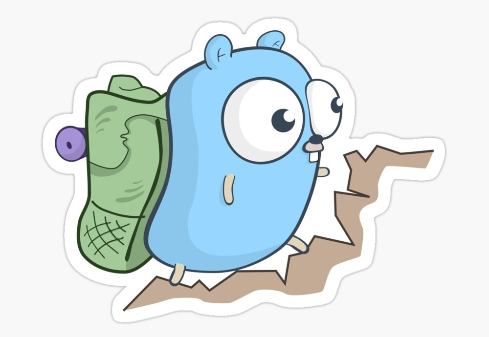

# Gopher

[](https://golangci.com/r/github.com/BarezAzad/gopher)
[](https://codebeat.co/projects/github-com-BarezAzad-gopher-master)
[](https://pkg.go.dev/github.com/BarezAzad/gopher)
[](https://opensource.org/licenses/MIT)



### Golang backend server

### Run

```bash
source cmd/app/dev.sample.env
reflex -r '\.go' -s -- sh -c 'go run cmd/app/main.go'
```

### Time Zone

To prevent Time zone issue,

```
time.Now().In(s.Engine.TZ)
```

## Log levels

```
logger.ServerLog.Trace(err.Error())
logger.ServerLog.Debug(err.Error())
logger.ServerLog.Info(err.Error())
logger.ServerLog.Warn(err.Error())
logger.ServerLog.Error(err.Error())
logger.ServerLog.Fatal(err.Error())
logger.ServerLog.Panic(err.Error())
```

## Binding Notes

- "bind" tag it use for binding model
- it can be separate by action, ex: bind:"create:required,min=1|update:required"  
  or you can skip action without mention actions ex: bind:"required,min=1"

#### Tags

- required : required field
- min=9 : min length
- max=10 : max length
- gte=10.6 : greater than
- lte=10 : less than
- oneof=usertypes : define a enum for usertypes,and add enum to internal/core/enum > MustBeInTypes
- contain=a : that field should be contain (a)
- email : it use to validate email

Example

```
type User struct {
	model.Common
	RoleID      uint    `gorm:"index:role_id_idx" json:"role_id" bind:"required"`
	Name        string  `gorm:"not null" json:"name,omitempty" bind:"required,min=5"`
	Username    string  `gorm:"not null;unique" json:"username,omitempty" bind:"required"`
	Password    string  `gorm:"not null" json:"password,omitempty" bind:"required,min=8,max=20"`
	Lang        string  `gorm:"type:varchar(2);default:'en'" json:"lang,omitempty" bind:"oneof=languagetype"`
	Email       string  `gorm:"not null" json:"email,omitempty" bind:"required,email"`
}
```

## Authentication

API for profile, reset password, logout, update profile(change password is optional),update language

## Redis

- It's used to caching resources and control permissions.
- It's used for caching APIs ex: list of all roles

## Transaction

Handling transaction in API layer to repo example for it in city APIs

## Upload Document and Download

- Upload document its service you can injected in your services and it support file and base64
- Validation for document per document types
- It's allow to upload single doc or multi docs

## RSA

- It's used for encrypt and decrypt cipher text, example for using this technic like Gift APIs

```
// bind cipher data to model
if err = resp.BindCipher(&gift, "E1000046"); err != nil {
		return
}
```

#### Generate public and private key for RSA

```
openssl genrsa -out private-key.pem 8192
openssl rsa -in private-key.pem -pubout -out public-key.pem
cat public-key.pem && cat private-key.pem
```

## Error handling

We have some special method for handing errors which they are optimizing code for you

```
// validation error
 p.Engine.ErrorLog.TickValidate( err, "E1000088", entity, action, data)

 // bad request error
 p.Engine.ErrorLog.TickBadRequest( err, "E1000088", entity, action, data)

 // record not found error
 p.Engine.ErrorLog.TickRecordNotFound( err, "E1000088", entity, data)

  // Unauthorized error
 p.Engine.ErrorLog.TickUnauthorized( err, "E1000088", data)

  // Route Not Found error
 p.Engine.ErrorLog.TickRouteNotFound( err, "E1000088", data)

 // Internal server error
 p.Engine.ErrorLog.TickInternalServer( err, "E1000088", data)

  // Forbidden error
 p.Engine.ErrorLog.TickForbidden( err, "E1000088", data)

  // custom error status and message
 p.Engine.ErrorLog.TickCustom( err,"E1000088" ,corerr.BadRequestErr,data , "message")

  // it use for change message just for end user,in case you want change error message in api layer example
 p.Engine.ErrorLog.TickCustomMessage(err, "E1000088", "message")
```

## Generate error codes

- The below line,it's in main method , it use for generate new error code

```
generateerrcode.GenerateNewErrCode()
```
tesa
